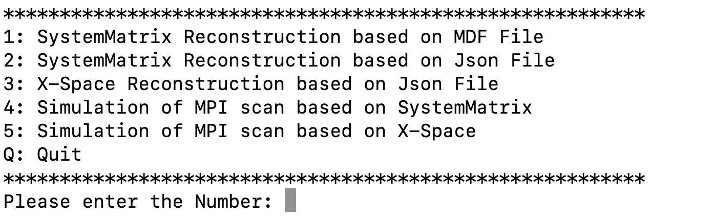
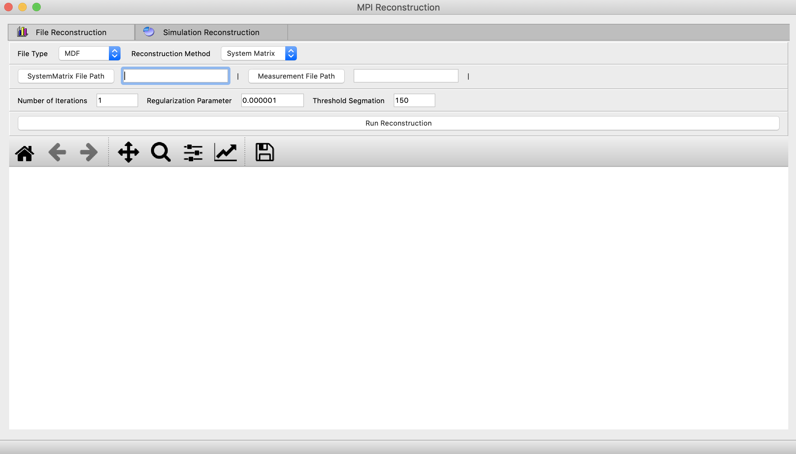

# Magnetic Particle Imaging Reconstruction Framework

## INTRODUCTION

The MPIRF is developed by Python 3.8. It could integrate different MPI reconstruction algorithm and realize the reconstruction function from the voltage signal of the magnetic nanoparticle to the image signal.  
  
The current version provides two main function files: `MPIRFmain.py` and `MPIRFUImain.py`.

*Executable File* includes the MPIRF with GUI compiled into binary executable files in Windows system.  

In Windows, clicking file **MPIRFUImain.exe** to execute the binary files.  

In Windows system, it also include a version with GPU. The test of the version were performed using the following hardware:  
>**GPU NVIDIA GeForce GTX 1070 8G**

## ARCHITECTURE
  
Specifically see the paper: *Magnetic particle imaging reconstruction framework integrated with simulation of MPI scan*

## INSTALLATION
  
The following dependent libraries need to be installed:

1.  `pip install numpy`
2.  `pip install scipy`
3.  `pip install h5py`
4.  `pip install matplotlib`
5.  `pip install numba`

To run `MPIRFUImain.py`, you also need to install:

6.  `pip install pyqt5`

## RUNING THE EXAMPLE
  
1.  `python MPIRFmain.py`, the result of the runing is shown in the figure:

 

2.  `python MPIRFUImain.py`, the result of the runing is shown in the figure:

 
